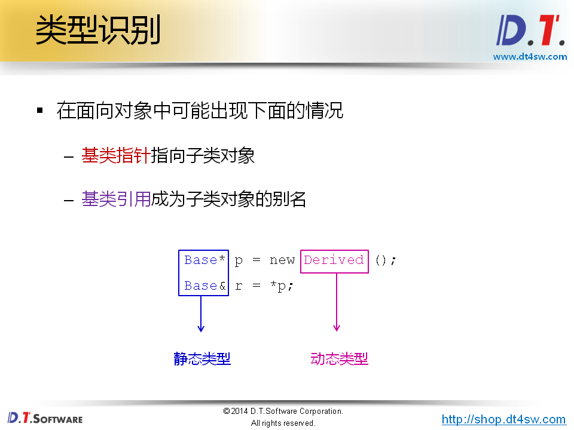
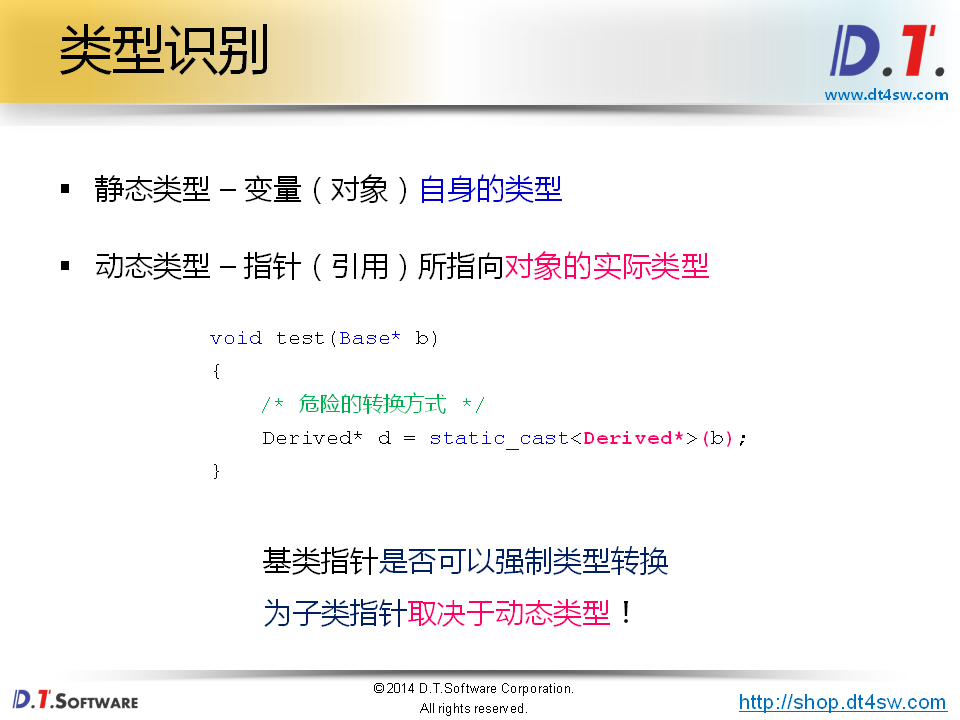
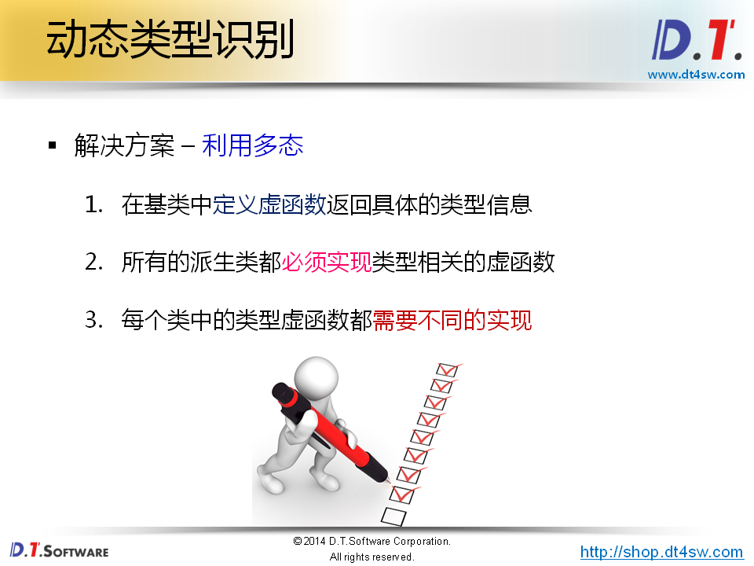
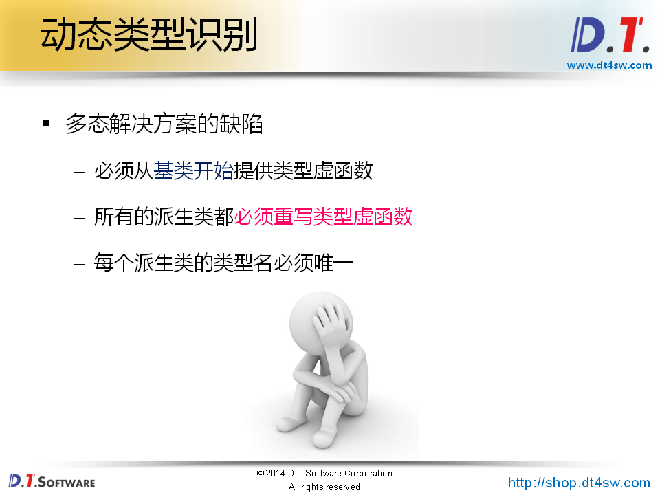
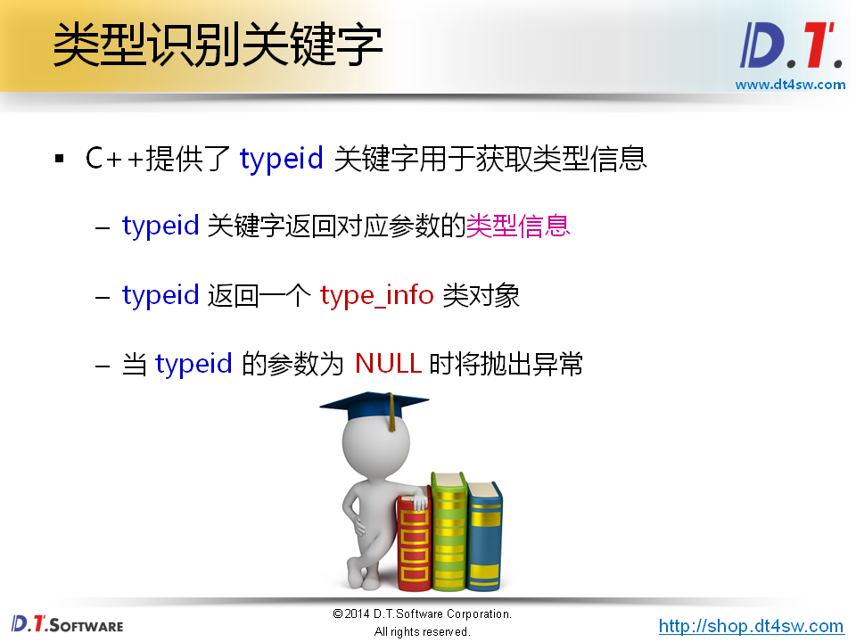
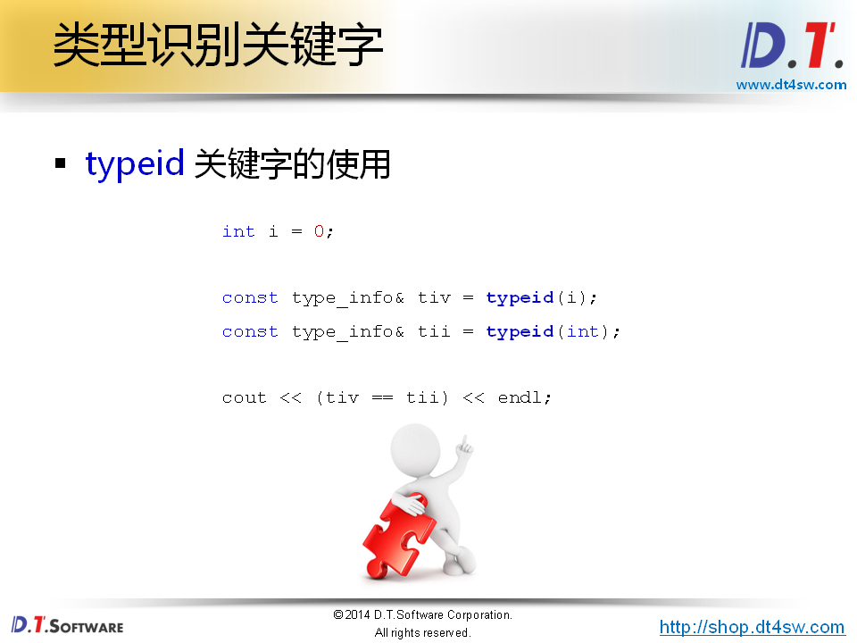
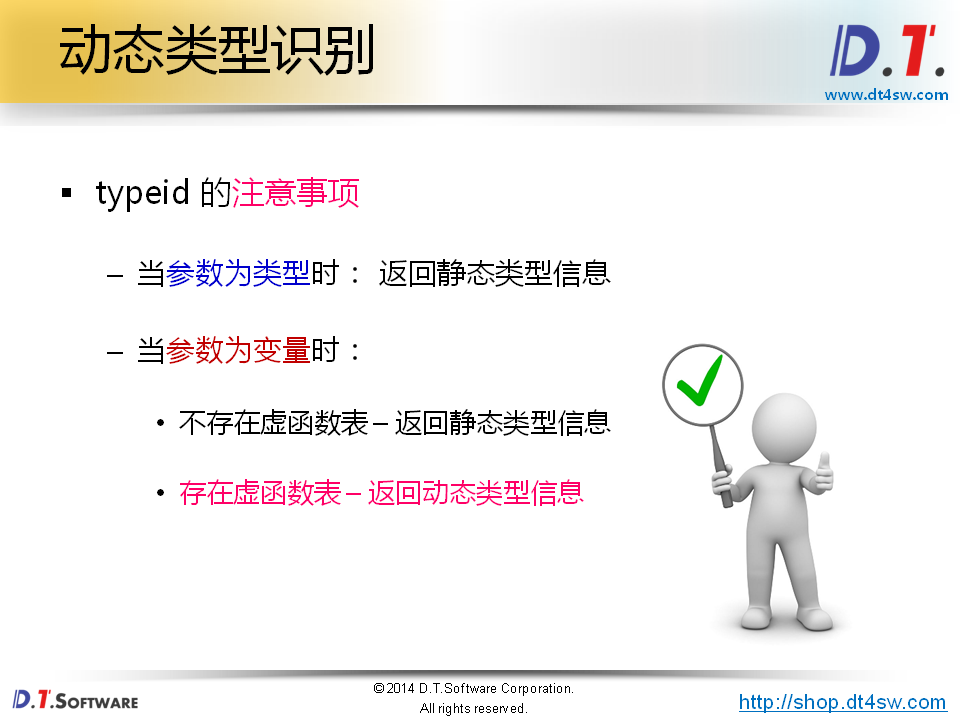
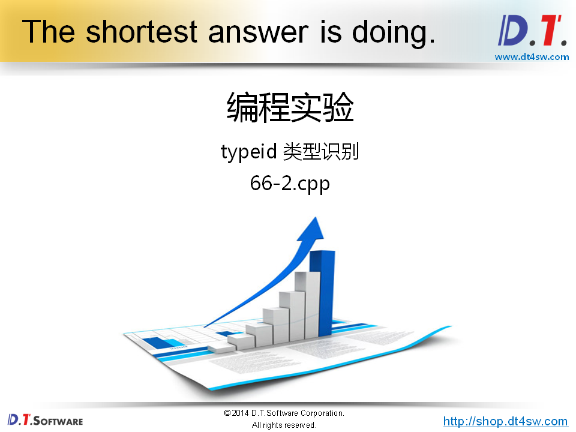
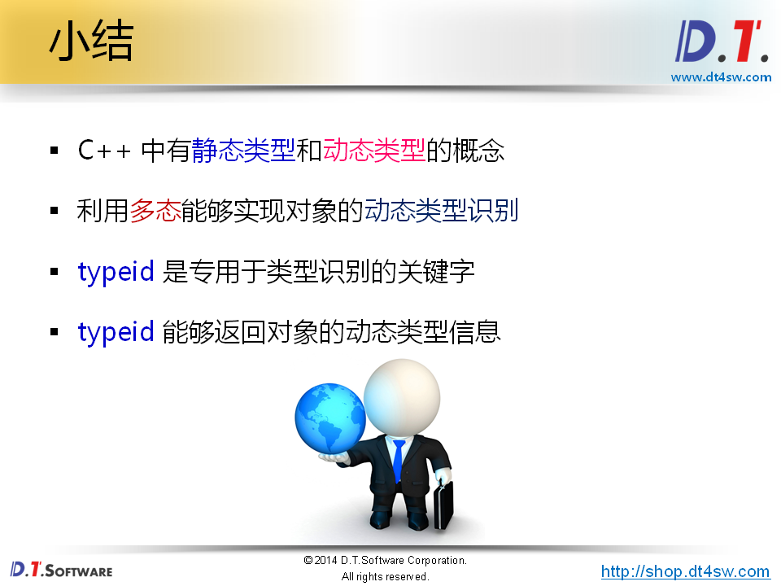

# 66.C++ 中的类型识别

 




**没办法通过p指针知道指向的类型**



**需要判断Base的类型**


 




```cpp
#include <iostream>
#include <string>

using namespace std;

class Base
{
public:
    virtual string type()
    {
        return "Base";
    }
};

class Derived : public Base
{
public:
    string type()
    {
        return "Derived";
    }
    
    void printf()
    {
        cout << "I'm a Derived." << endl;
    }
};

class Child : public Base
{
public:
    string type()
    {
        return "Child";
    }
};

void test(Base* b)
{
    /* 危险的转换方式 */
    // Derived* d = static_cast<Derived*>(b);
    
    if( b->type() == "Derived" )
    {
        Derived* d = static_cast<Derived*>(b);
        
        d->printf();
    }
    
    // cout << dynamic_cast<Derived*>(b) << endl;
}


int main(int argc, char *argv[])
{
    Base b;
    Derived d;
    Child c;
    
    test(&b);
    test(&d);
    test(&c);
    
    return 0;
}


```



**忘了写虚函数-->会导致问题维护性不好**

**如何优化？**



参数可以是类型名，对象名，变量名






**很重要的知识点**



```cpp
#include <iostream>
#include <string>
#include <typeinfo>

using namespace std;

class Base
{
public:
    virtual ~Base()
    {
    }
};

class Derived : public Base
{
public:
    void printf()
    {
        cout << "I'm a Derived." << endl;
    }
};

void test(Base* b)
{
    const type_info& tb = typeid(*b);
    
    cout << tb.name() << endl;
}

int main(int argc, char *argv[])
{
    int i = 0;
    
    const type_info& tiv = typeid(i);
    const type_info& tii = typeid(int);
    
    cout << (tiv == tii) << endl;
    
    Base b;
    Derived d;
    
    test(&b);
    test(&d);
    
    return 0;
}
```

**不同编译器之间的行为是不一样的；**

