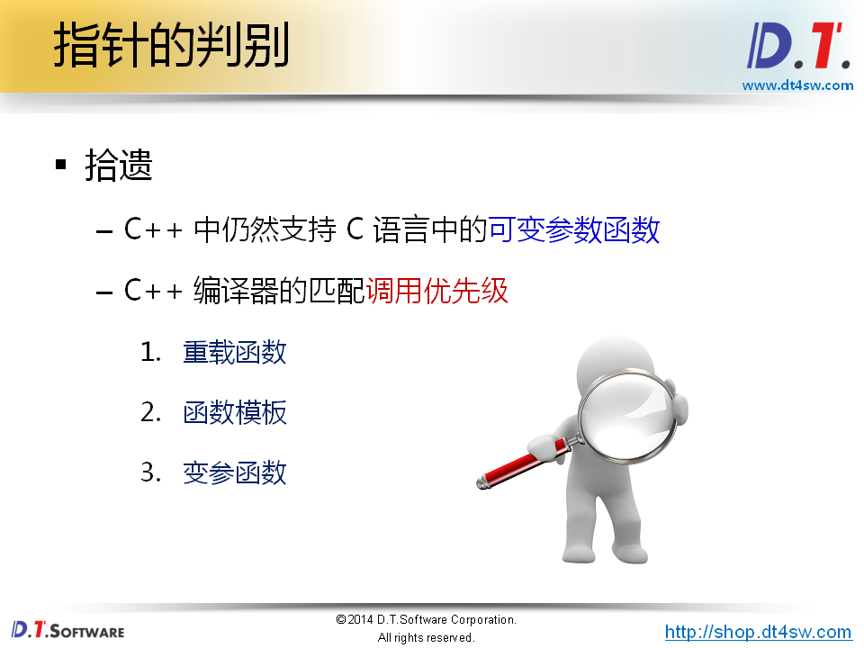
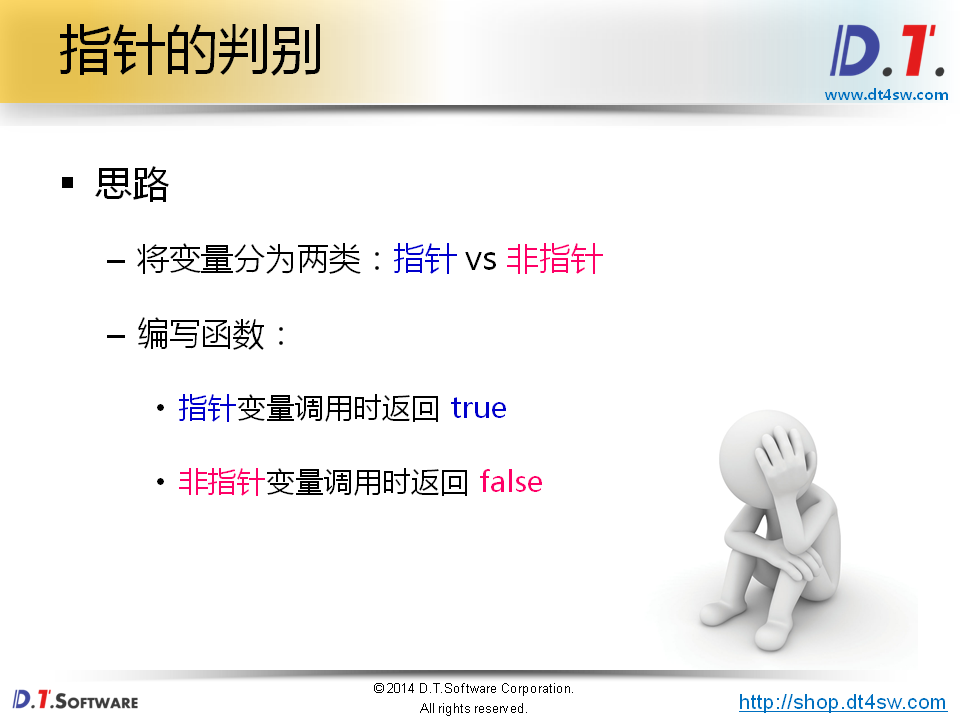
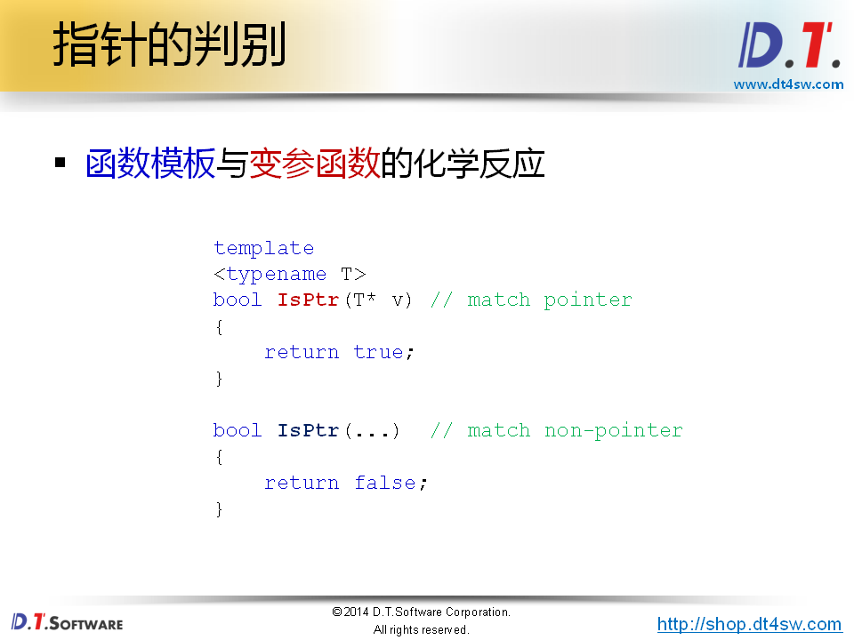
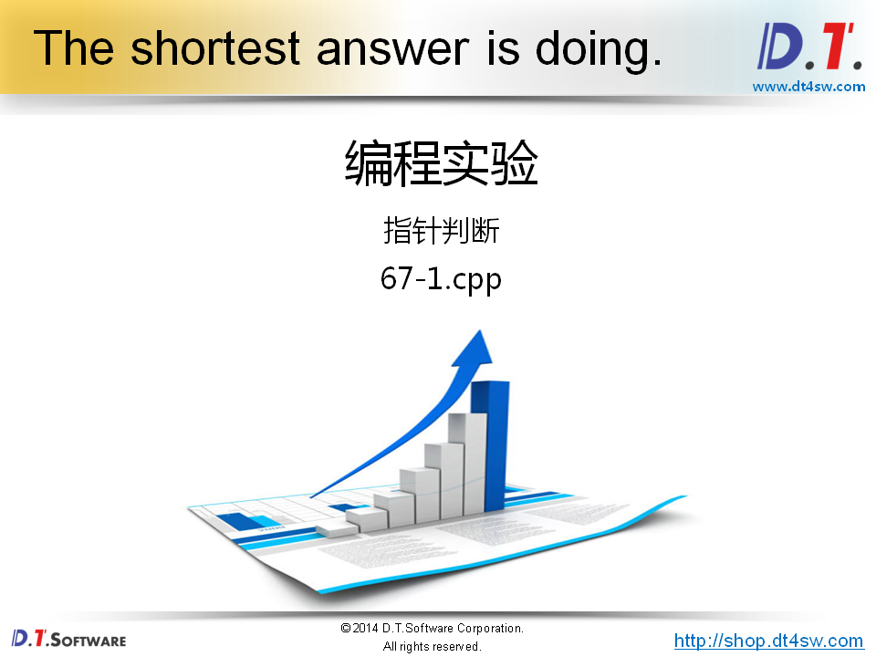
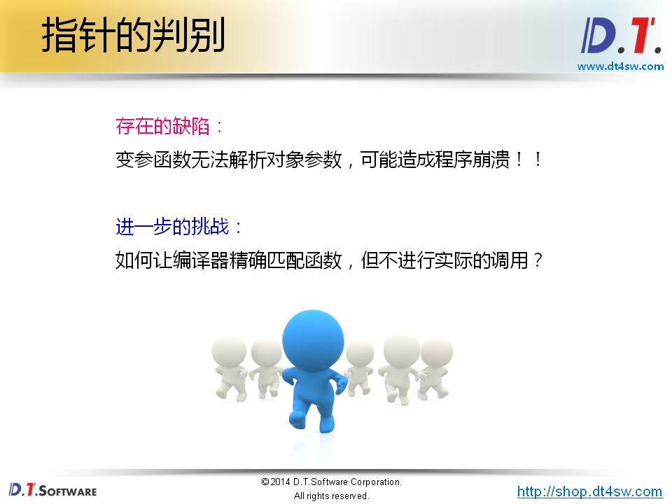
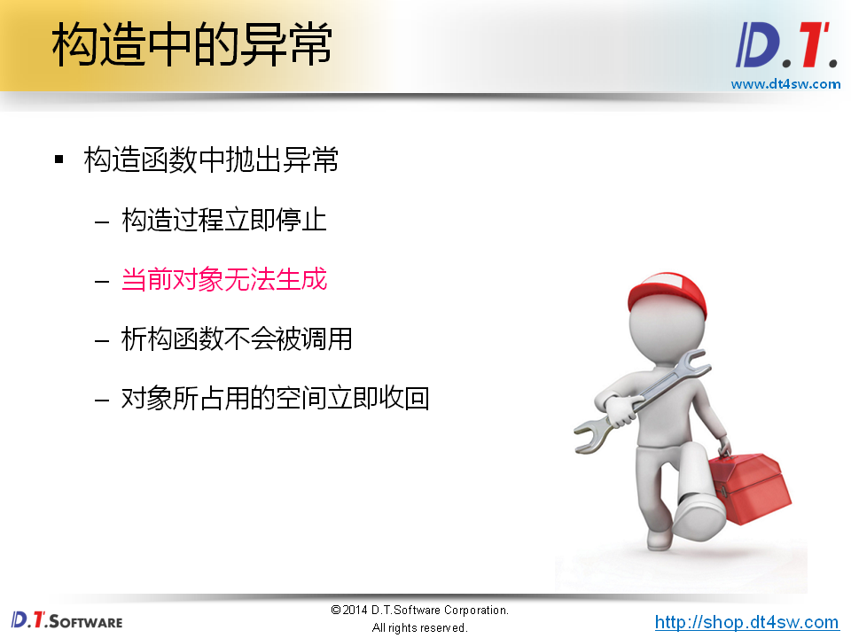
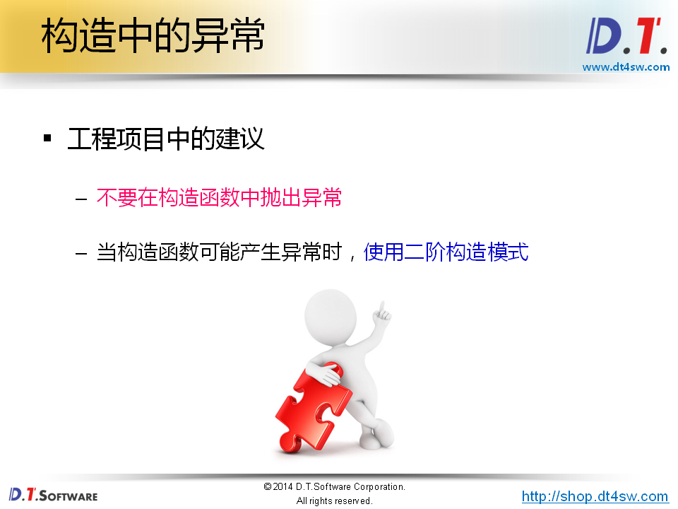
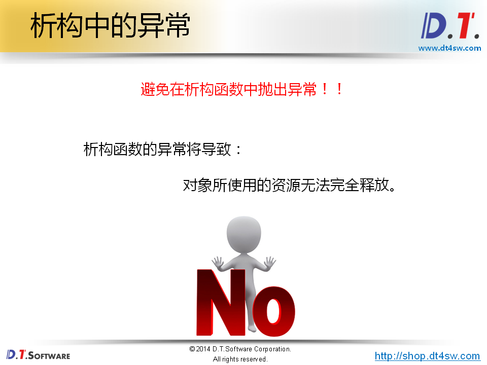

# 67.经典问题解析五













```cpp
#include <iostream>
#include <string>

using namespace std;

class Test
{
public:
    Test()
    {
    }
    virtual ~Test()
    {
    }
};

template
<typename T>
char IsPtr(T* v) // match pointer-》一个字节
{
    return 'd';
}

int IsPtr(...)  // match non-pointer-》四个字节
{
    return 0;
}

#define ISPTR(p) (sizeof(IsPtr(p)) == sizeof(char))

int main(int argc, char *argv[])
{
    int i = 0; // 使用模板解决不了自定义类型，所以又有优化
    int* p = &i;
    
    cout << "p is a pointer: " << ISPTR(p) << endl;    // true
    cout << "i is a pointer: " << ISPTR(i) << endl;    // false
    
    Test t;// 判断不了类类型-》非法指令
    Test* pt = &t;
    
    cout << "pt is a pointer: " << ISPTR(pt) << endl;    // true
    cout << "t is a pointer: " << ISPTR(t) << endl;    // false
    
    return 0;
}


```

**只让编译器编译时匹配，不让函数调用实际运行，绕开程序崩溃的问题**-》使用**sizeof**






**重点**



https://www.zhihu.com/question/430968645-》现在的实践建议建议抛出异常-》使用RAII回收


```cpp
#include <iostream>
#include <string>

using namespace std;

class Test
{
public:
    Test()
    {
        cout << "Test()" << endl;
        
        throw 0;// 抛出异常后，没有产生内存泄漏
    }
    virtual ~Test()
    {
        cout << "~Test()" << endl;
    }
};


int main(int argc, char *argv[])
{
    Test* p = reinterpret_cast<Test*>(1);
    
    try
    {
        p = new Test();
    }
    catch(...)
    {
        cout << "Exception..." << endl;
    }
    
    cout << "p = " << p << endl;
    
    return 0;
}


```




