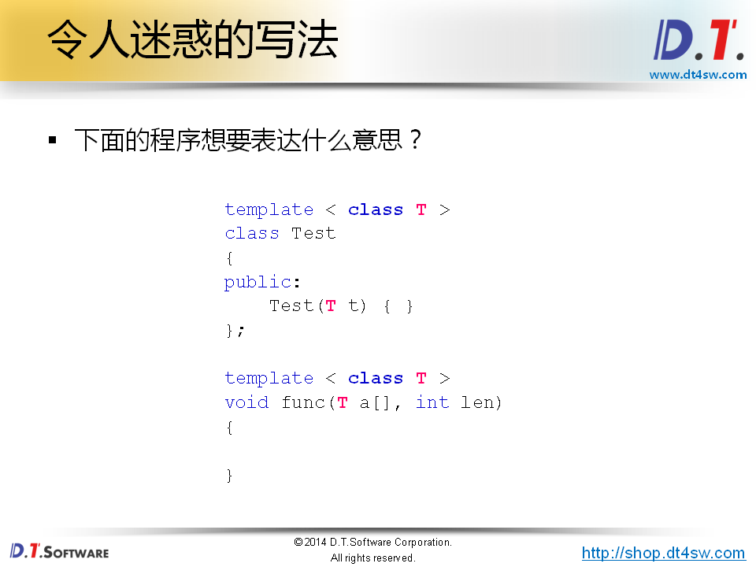
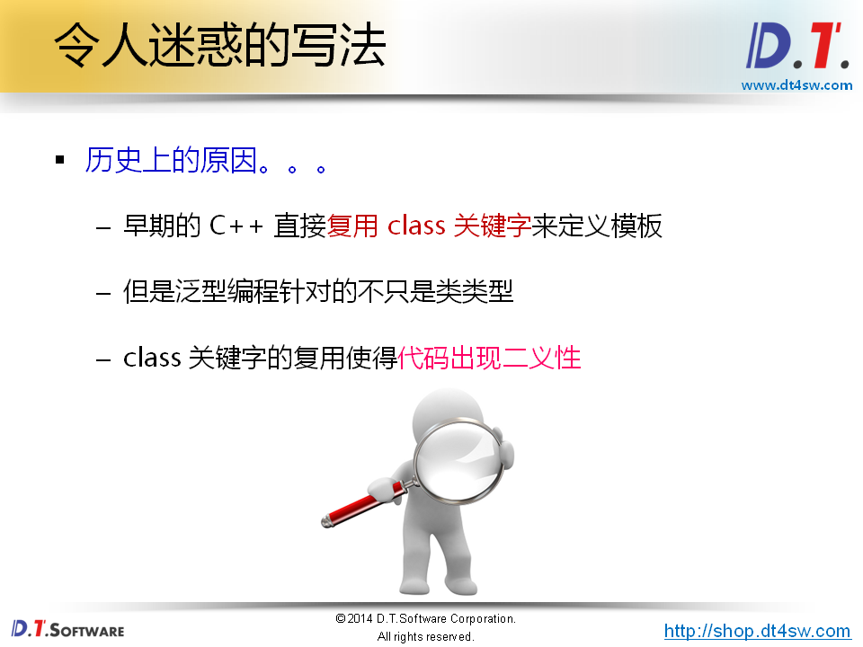
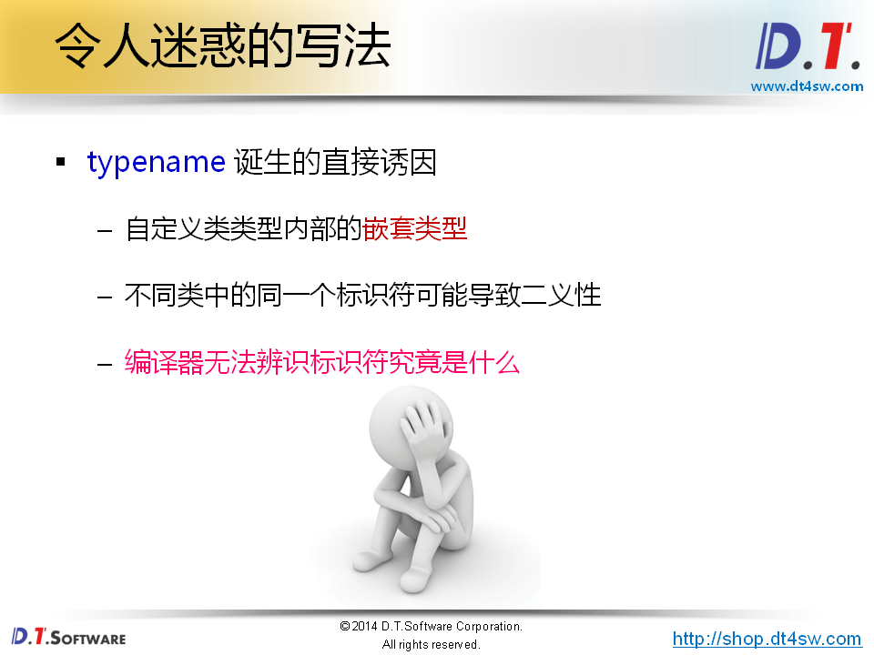
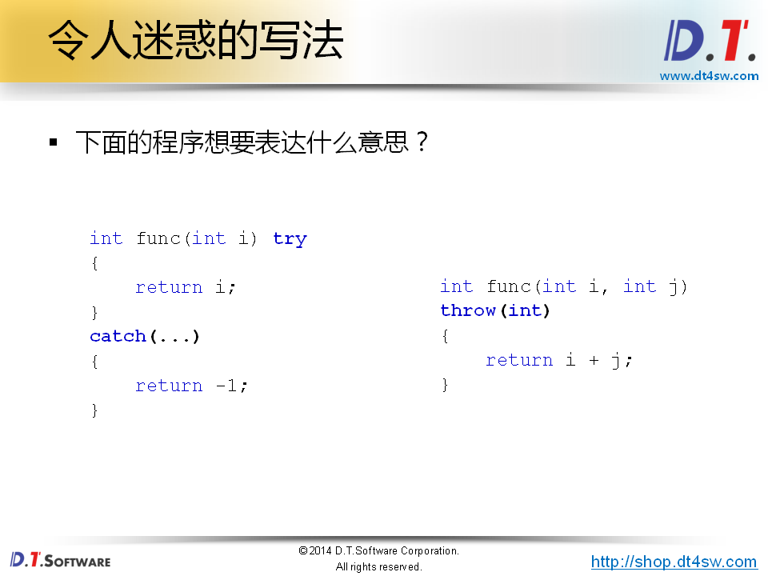
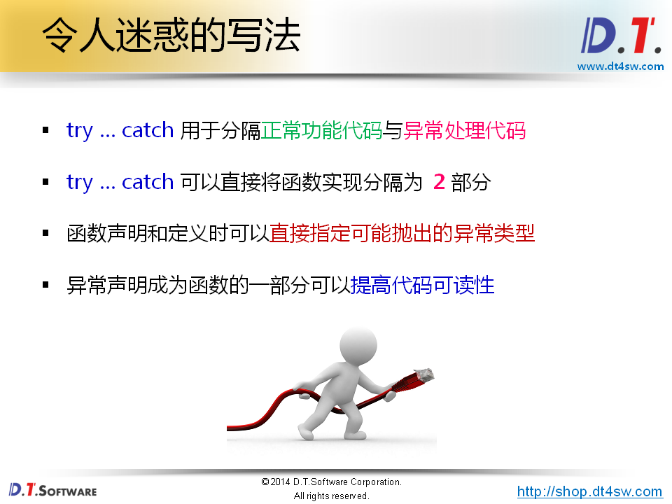
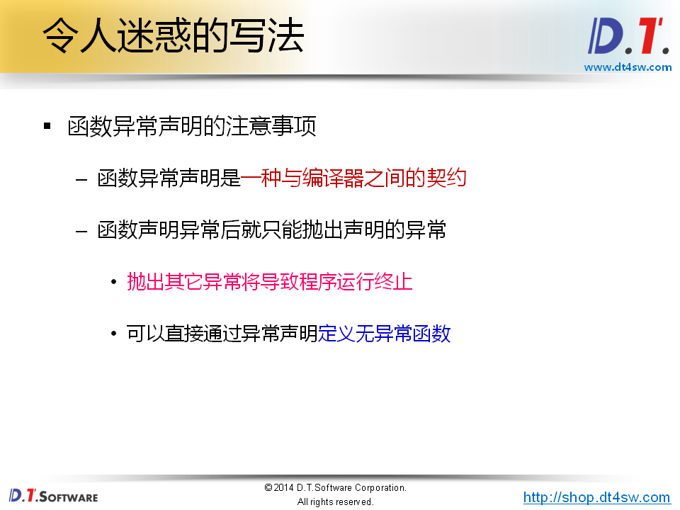
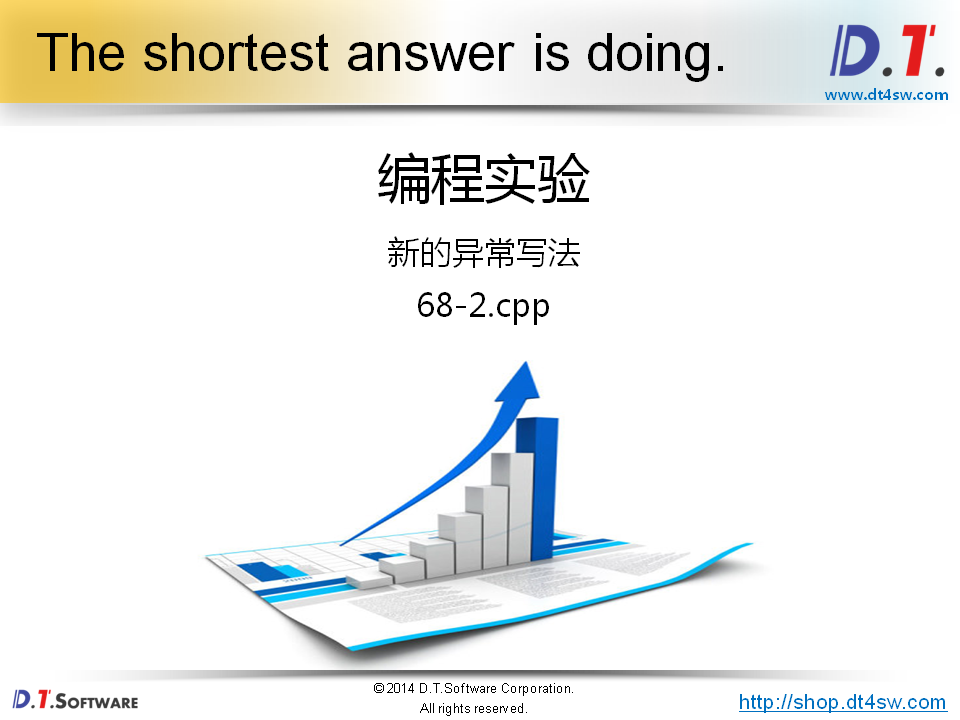
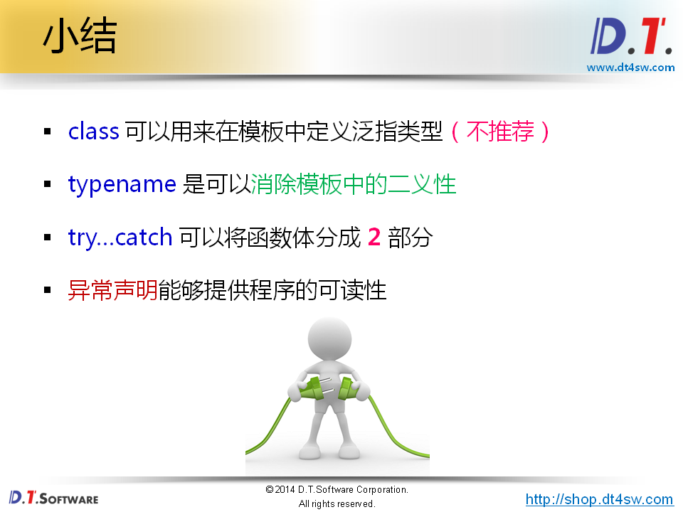

# 68.拾遗令人迷惑的写法




**T泛指类类型**-》能编译通过







```cpp
#include <iostream>
#include <string>

using namespace std;

template < class T > // class在这里和typename完全一样
class Test
{
public:
    Test(T t) 
    { 
        cout << "t = " << t << endl;
    }
};

template < class T >
void func(T a[], int len)
{
    for(int i=0; i<len; i++)
    {
        cout << a[i] << endl;
    }
}


//////////////////////////////////////////////////////////////以下二义性问题
//////////////////////////////////////////////////////////////

int a = 0;

class Test_1
{
public:
    static const int TS = 1;
};

class Test_2
{
public:
    struct TS
    {
        int value;
    };
};

template
< class T >
void test_class()
{
    typename T::TS * a;        // 1. 通过泛指类型 T 内部的数据类型 TS 定义指针变量 a （推荐的解读方式）
                               // 2. 使用泛指类型 T 内部的静态成员变量 TS 与全局变量 a 进行乘法操作
}


int main(int argc, char *argv[])
{
    // test_class<Test_1>(); // 编译器编译出来是TS * a乘以
    test_class<Test_2>(); // 编译器出错，50行使用typename来把它作为静态变量而不是数据类型；
    
    return 0;
}


```

**typename**

* 1.定义泛指类型
* 2.告诉编译器紧跟其后的是一个类型











```cpp
#include <iostream>
#include <string>

using namespace std;

int func(int i, int j) throw(int, char)
{
    if( (0 < j) && (j < 10) )
    {
        return (i + j);
    }
    else
    {
        throw '0';
    }
}

void test(int i) try
{
    cout << "func(i, i) = " << func(i, i) << endl;
}
catch(int i)
{
    cout << "Exception: " << i << endl;
}
catch(...)
{
    cout << "Exception..." << endl;
}


int main(int argc, char *argv[])
{
    test(5);
    
    test(10);
    
    return 0;
}


```

