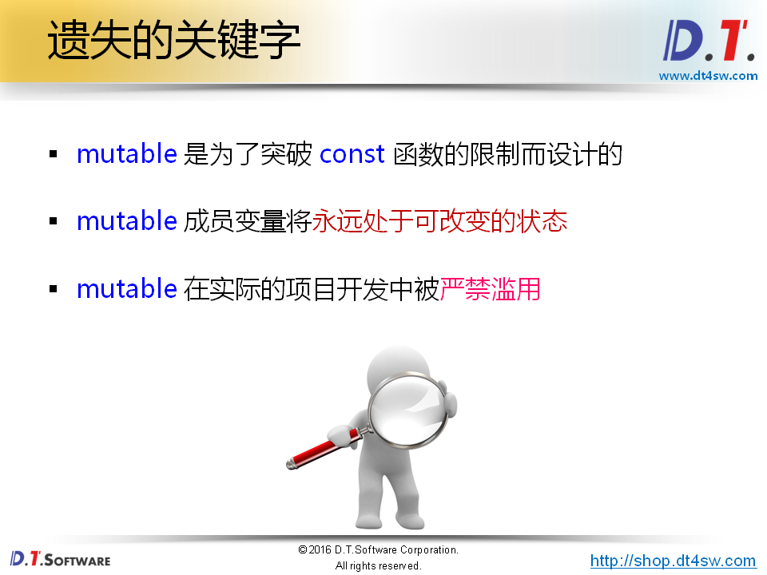

# 69.技巧:自定义内存管理





```cpp
#include <iostream>
#include <string>

using namespace std;

class Test
{
    int m_value;
    int * const m_pCount; // 指针初始化后不能被改变
    /* mutable int m_count; */ // mutable可以让变量用于处于可变状态
public:
    Test(int value = 0) : m_pCount(new int(0))
    {
        m_value = value;
        /* m_count = 0; */
    }
    
    int getValue() const
    {
        /* m_count++; */// const成员函数内部不能改变
        *m_pCount = *m_pCount + 1;
        return m_value;
    }
    
    void setValue(int value)
    {
        /* m_count++; */
        *m_pCount = *m_pCount + 1; // 操作指针指向的空间
        m_value = value;
    }
    
    int getCount() const
    {
        /* return m_count; */
        return *m_pCount;
    }

    ~Test()
    {
        delete m_pCount;
    }
};

int main(int argc, char *argv[])
{
    Test t;
    
    t.setValue(100);
    
    cout << "t.m_value = " << t.getValue() << endl;
    cout << "t.m_count = " << t.getCount() << endl;
    
    const Test ct(200);
    
    cout << "ct.m_value = " << ct.getValue() << endl;
    cout << "ct.m_count = " << ct.getCount() << endl;
    
    return 0;
}


```


new和delete是操作符-》C++操作符重载


**重载的是改变内存分配方式-》new处理的对象可以不放在堆空间**


```cpp
#include <iostream>
#include <string>

using namespace std;

class Test
{
    static const unsigned int COUNT = 4;
    static char c_buffer[];
    static char c_map[];
    
    int m_value;
public:
    void* operator new (unsigned int size)
    {
        void* ret = NULL;
        
        for(int i=0; i<COUNT; i++)
        {
            if( !c_map[i] )
            {
                c_map[i] = 1;
                
                ret = c_buffer + i * sizeof(Test);
                
                cout << "succeed to allocate memory: " << ret << endl;
                
                break;
            }
        }
        
        return ret;
    }
    
    void operator delete (void* p)
    {
        if( p != NULL )
        {
            char* mem = reinterpret_cast<char*>(p);
            int index = (mem - c_buffer) / sizeof(Test);
            int flag = (mem - c_buffer) % sizeof(Test);
            
            if( (flag == 0) && (0 <= index) && (index < COUNT) )
            {
                c_map[index] = 0;
                
                cout << "succeed to free memory: " << p << endl;
            }
        }
    }
};

char Test::c_buffer[sizeof(Test) * Test::COUNT] = {0};
char Test::c_map[Test::COUNT] = {0};

int main(int argc, char *argv[])
{
    cout << "===== Test Single Object =====" << endl;
     
    Test* pt = new Test;
    
    delete pt;
    
    cout << "===== Test Object Array =====" << endl;
    
    Test* pa[5] = {0};
    
    for(int i=0; i<5; i++)
    {
        pa[i] = new Test;
        
        cout << "pa[" << i << "] = " << pa[i] << endl;
    }
    
    for(int i=0; i<5; i++)
    {
        cout << "delete " << pa[i] << endl;
        
        delete pa[i];
    }
    
    return 0;
}


```


```cpp
#include <iostream>
#include <string>
#include <cstdlib>

using namespace std;

class Test
{
    static unsigned int c_count;
    static char* c_buffer;
    static char* c_map;
    
    int m_value;
public:
    static bool SetMemorySource(char* memory, unsigned int size)
    {
        bool ret = false;
        
        c_count = size / sizeof(Test);
        
        ret = (c_count && (c_map = reinterpret_cast<char*>(calloc(c_count, sizeof(char)))));
        
        if( ret )
        {
            c_buffer = memory;
        }
        else
        {
            free(c_map);
            
            c_map = NULL;
            c_buffer = NULL;
            c_count = 0;
        }
        
        return ret;
    }
    
    void* operator new (unsigned int size)
    {
        void* ret = NULL;
        
        if( c_count > 0 )
        {
            for(int i=0; i<c_count; i++)
            {
                if( !c_map[i] )
                {
                    c_map[i] = 1;
                    
                    ret = c_buffer + i * sizeof(Test);
                    
                    cout << "succeed to allocate memory: " << ret << endl;
                    
                    break;
                }
            }
        }
        else
        {
            ret = malloc(size);
        }
        
        return ret;
    }
    
    void operator delete (void* p)
    {
        if( p != NULL )
        {
            if( c_count > 0 )
            {
                char* mem = reinterpret_cast<char*>(p);
                int index = (mem - c_buffer) / sizeof(Test);
                int flag = (mem - c_buffer) % sizeof(Test);
                
                if( (flag == 0) && (0 <= index) && (index < c_count) )
                {
                    c_map[index] = 0;
                    
                    cout << "succeed to free memory: " << p << endl;
                }
            }
            else
            {
                free(p);
            }
        }
    }
};

unsigned int Test::c_count = 0;
char* Test::c_buffer = NULL;
char* Test::c_map = NULL;

int main(int argc, char *argv[])
{
    char buffer[12] = {0};
    
    Test::SetMemorySource(buffer, sizeof(buffer));
    
    cout << "===== Test Single Object =====" << endl;
     
    Test* pt = new Test;
    
    delete pt;
    
    cout << "===== Test Object Array =====" << endl;
    
    Test* pa[5] = {0};
    
    for(int i=0; i<5; i++)
    {
        pa[i] = new Test;
        
        cout << "pa[" << i << "] = " << pa[i] << endl;
    }
    
    for(int i=0; i<5; i++)
    {
        cout << "delete " << pa[i] << endl;
        
        delete pa[i];
    }
    
    return 0;
}


```


```cpp
#include <iostream>
#include <string>
#include <cstdlib>

using namespace std;

class Test
{
    int m_value;
public:
    Test()
    {
        m_value = 0;
    }
    
    ~Test()
    {
    }
    
    void* operator new (unsigned int size)
    {
        cout << "operator new: " << size << endl;
        
        return malloc(size);
    }
    
    void operator delete (void* p)
    {
        cout << "operator delete: " << p << endl;
        
        free(p);
    }
    
    void* operator new[] (unsigned int size)
    {
        cout << "operator new[]: " << size << endl;
        
        return malloc(size);
    }
    
    void operator delete[] (void* p)
    {
        cout << "operator delete[]: " << p << endl;
        
        free(p);
    }
};

int main(int argc, char *argv[])
{
    Test* pt = NULL;
    
    pt = new Test;
    
    delete pt;
    
    pt = new Test[5];
    
    delete[] pt;
    
    return 0;
}
```

