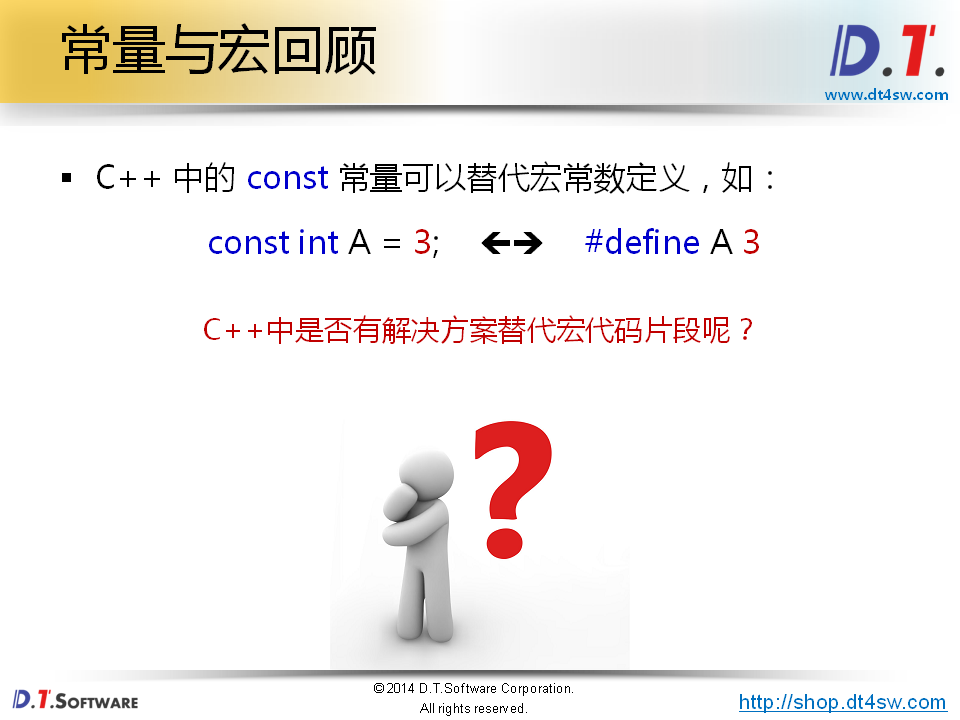
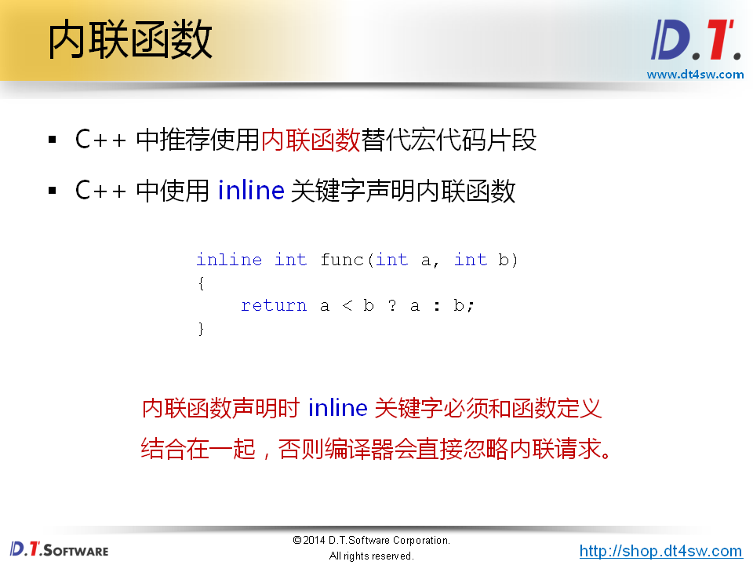
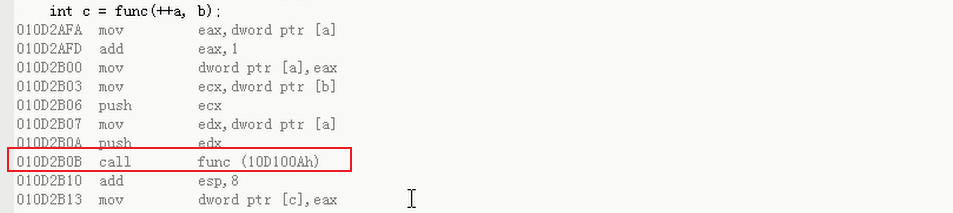
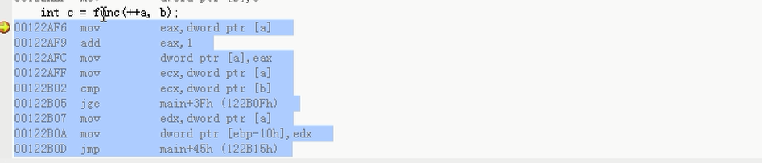
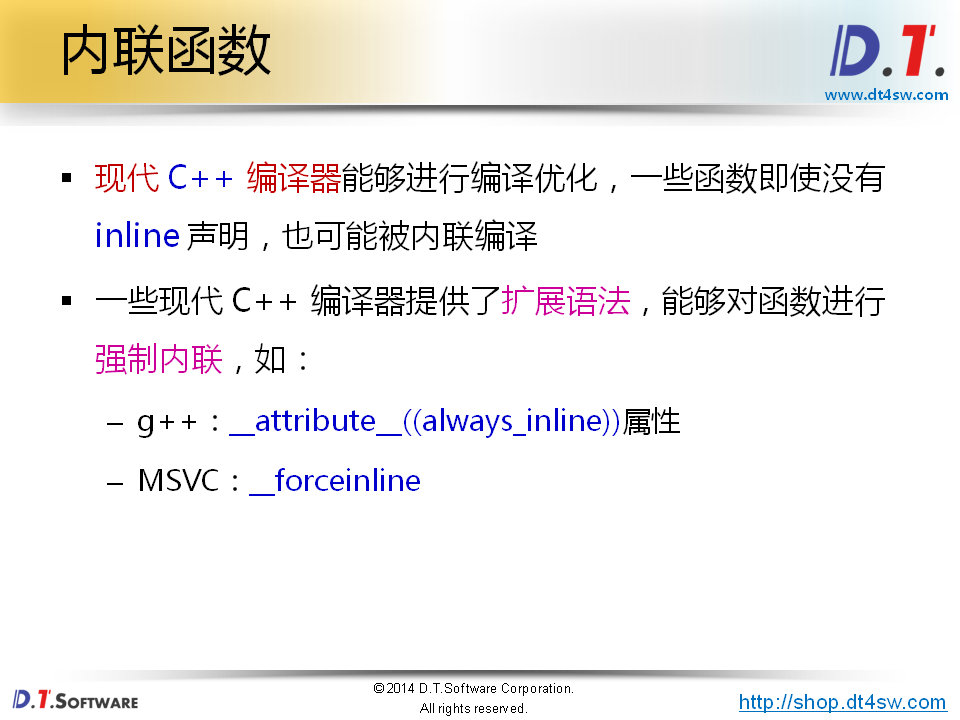
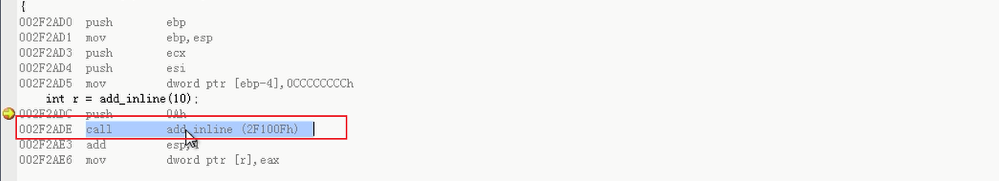
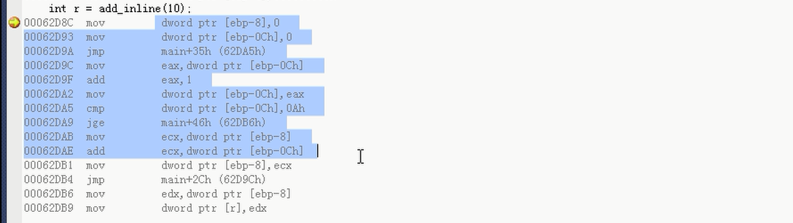
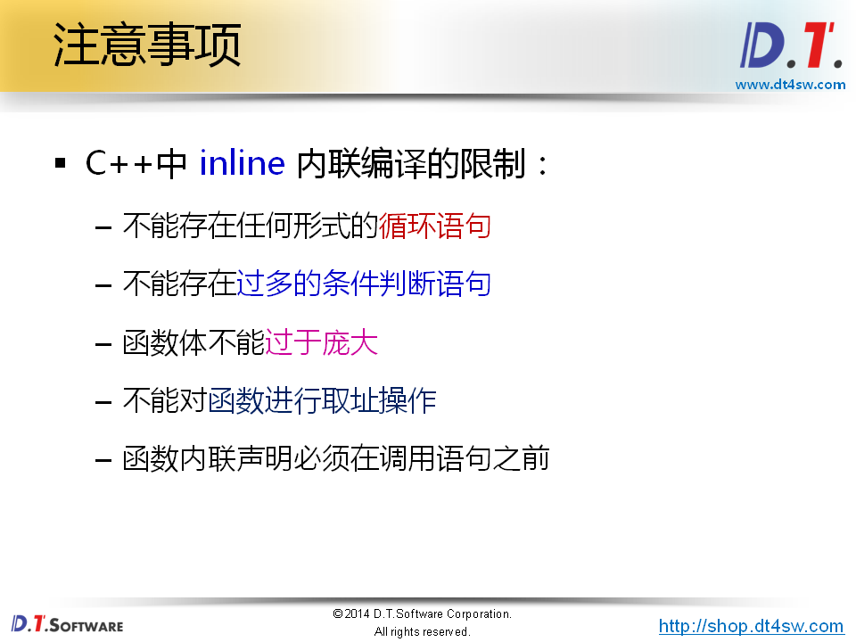

# 内联函数分析




 **const可以替换宏常量**

**替代宏代码块->inline就可以了**



**编译器会将inline函数的函数体，进行扩展-》不是文本替换，不在预处理阶段处理。而是在编译器阶段直接将编译生成的代码处理；**


```cpp
#include <stdio.h>

#define FUNC(a, b) ((a) < (b) ? (a) : (b))

inline int func(int a, int b)
{
    return a < b ? a : b;
}

int main(int argc, char *argv[])
{
    int a = 1;
    int b = 3;
    int c = FUNC(++a, b);
    // 展开
    // ((++a) < b) ? (++a):(b));
    					
    printf("a = %d\n", a); // 2
    printf("b = %d\n", b); // 3
    printf("c = %d\n", c); // 2
    
    return 0;
}

宏实际输出
    3
    3
    3
函数实际输出
    2
    3
    2
```



**可以看出依然有函数调用，说明inline只是一个建议；**

**Vs里面设置only_inline可以让它必须内联**



**内联请求成功了。没有函数的调用栈；**





```cpp
#include <stdio.h>

//__forceinline
//__attribute__((always_inline))
inline 
int add_inline(int n);

int main(int argc, char *argv[])
{
    int r = add_inline(10);

    printf(" r = %d\n", r);

    return 0;
}

inline int add_inline(int n)
{
    int ret = 0;

    for(int i=0; i<n; i++)
    {
        ret += i;
    }

    return ret;
}
```

拒绝了内联

强制内联后可以内联；






