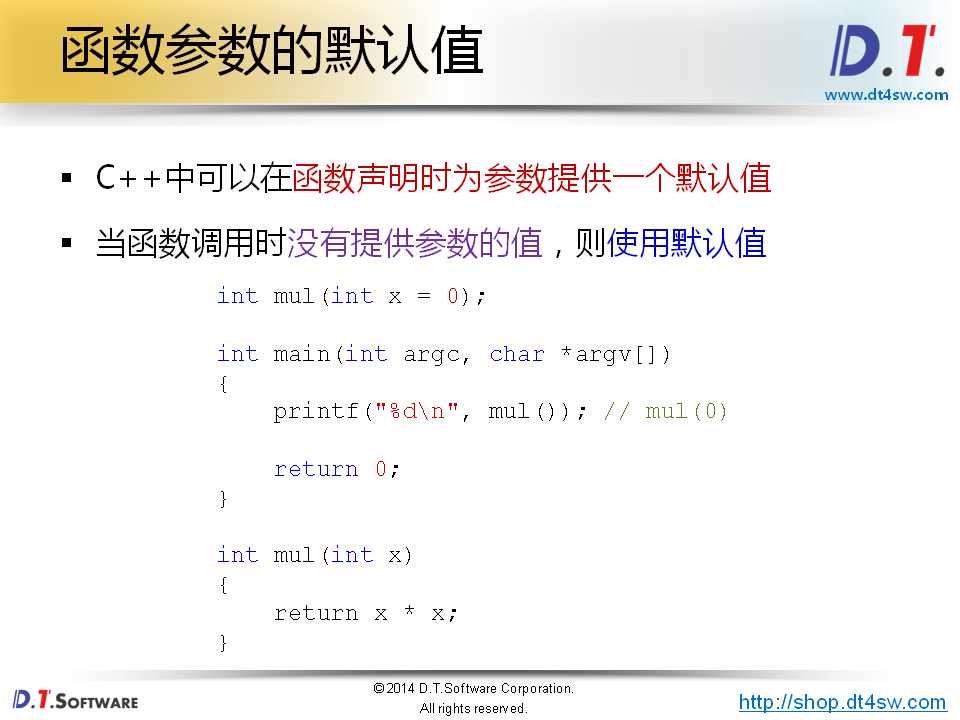
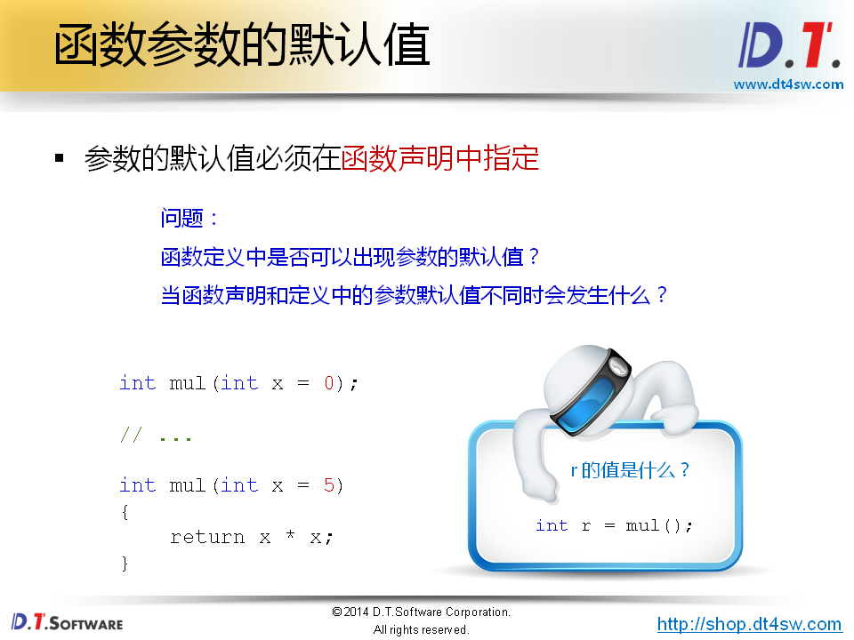
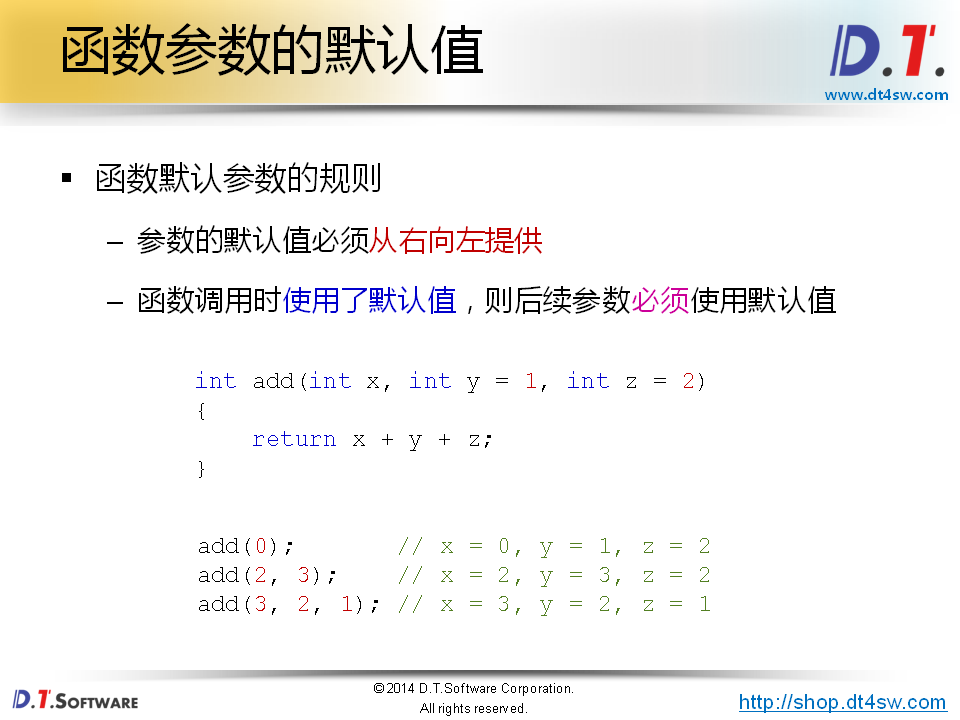
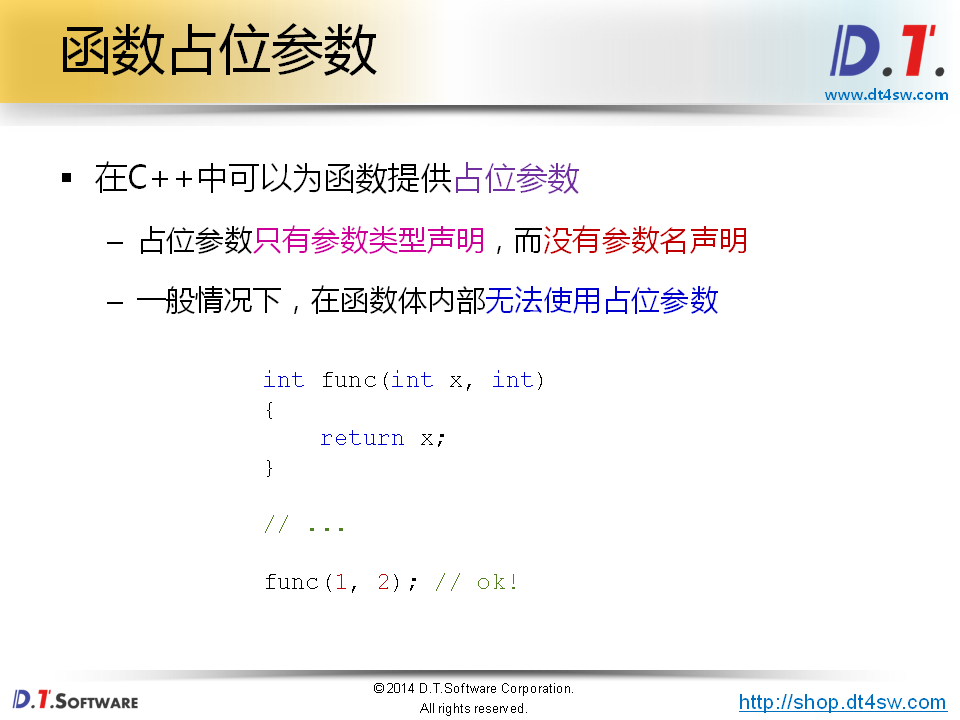
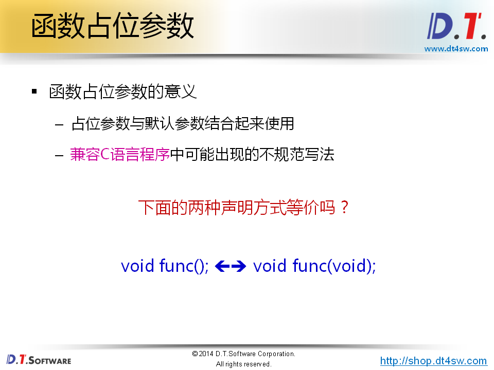

# 函数参数的拓展






**函数的声明时提供默认值，定义不需要；**


```cpp
#include <stdio.h>

int mul(int x = 0);

int main(int argc, char *argv[])
{
    printf("%d\n", mul());
    printf("%d\n", mul(-1));
    printf("%d\n", mul(2));
    
    return 0;
}

int mul(int x)
{
    return x * x;
}

输出：
    0
    1
    4
gcc 不行第三行有语法错误
    g++
    声明时定义一个默认值int mul(int x = 0);
    定义时在声明一个默认值int mul(int x = 5);
    error:default argument given for parameter 1 of 'int mul(int)'
    声明时定义一个默认值int mul(int x);
    定义时在声明一个默认值int mul(int x = 5);
    error:default argument given for parameter 1 of 'int mul(int)'
```



```cpp
g++
  	output
  	1
  	3
  	6
```


```cpp
#include <stdio.h>

int add(int x, int y = 0, int z = 0);

int main(int argc, char *argv[])
{
    printf("%d\n", add(1));       // 1
    printf("%d\n", add(1, 2));    // 3
    printf("%d\n", add(1, 2, 3)); // 6
    
    return 0;
}

int add(int x, int y, int z)
{
    return x + y + z;
}

修改
int add(int x, int y = 0, int z);
error：编译失败
如果修改成
     int add(int x, int z, int y)
     编译没有问题
    

```



**为社么要支持占位符？**



C语言中void func()表示接受任意多的参数；

C语言中不等价

C++中是等价


```cpp
#include <stdio.h>

int func(int x, int = 0);

int main(int argc, char *argv[])
{
    printf("%d\n", func(1));
    printf("%d\n", func(2, 3));
    
    return 0;
}

int func(int x, int)
{
    return x;
}
```

