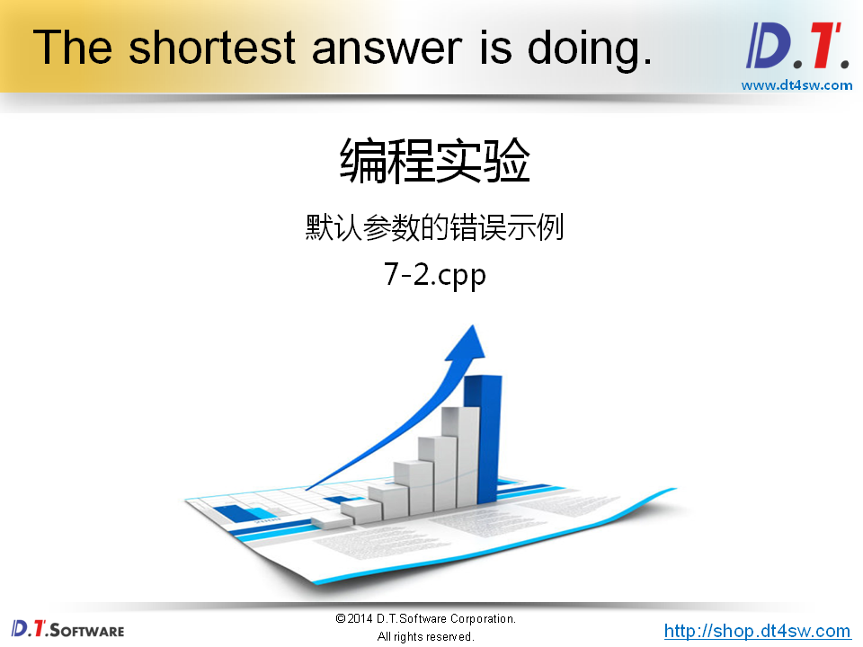
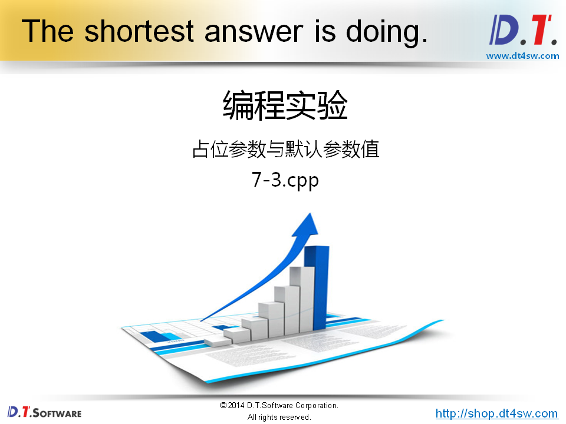

# 函数参数的拓展


**函数的声明时提供默认值，定义不需要；**


```cpp
#include <stdio.h>

int mul(int x = 0);

int main(int argc, char *argv[])
{
    printf("%d\n", mul());
    printf("%d\n", mul(-1));
    printf("%d\n", mul(2));
    
    return 0;
}

int mul(int x)
{
    return x * x;
}

输出：
    0
    1
    4
gcc 不行第三行有语法错误
```


```cpp
g++
  	output
  	1
  	3
  	6
```



```cpp
#include <stdio.h>

int add(int x, int y = 0, int z = 0);

int main(int argc, char *argv[])
{
    printf("%d\n", add(1));
    printf("%d\n", add(1, 2));
    printf("%d\n", add(1, 2, 3));
    
    return 0;
}

int add(int x, int y, int z)
{
    return x + y + z;
}


```


**为社么要支持占位符？**





