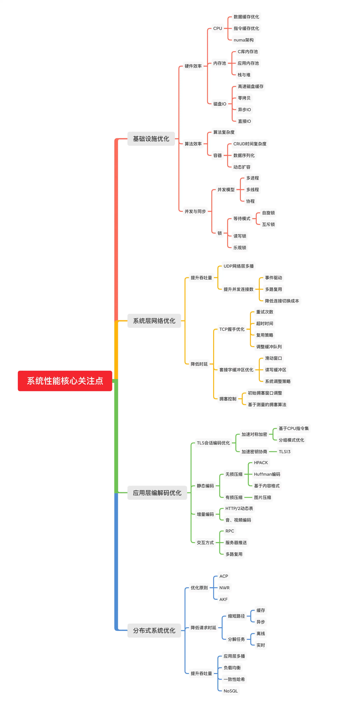
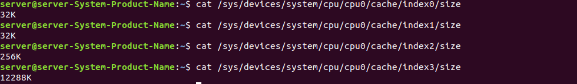
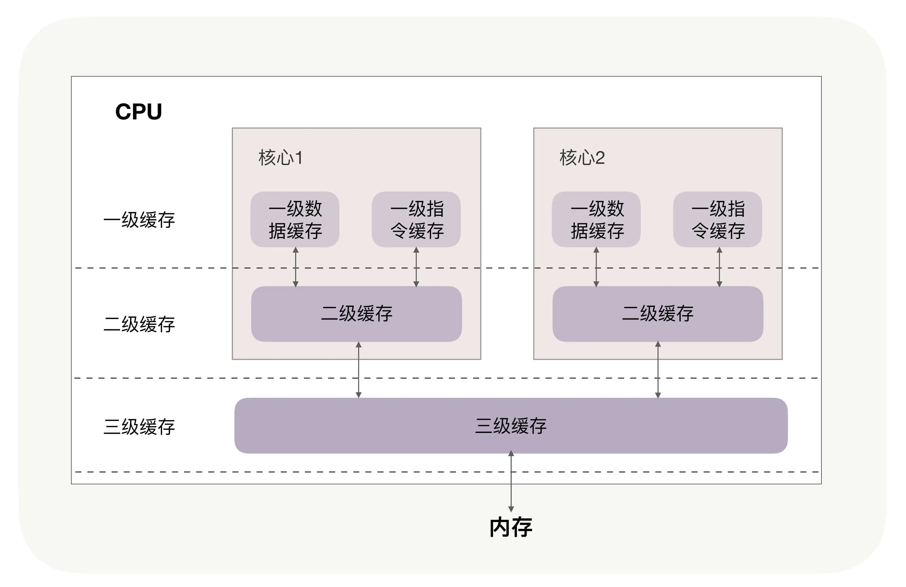
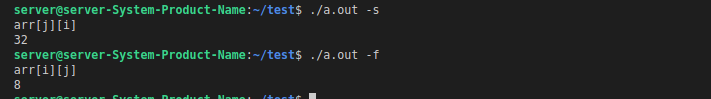
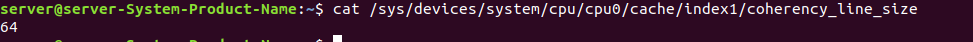
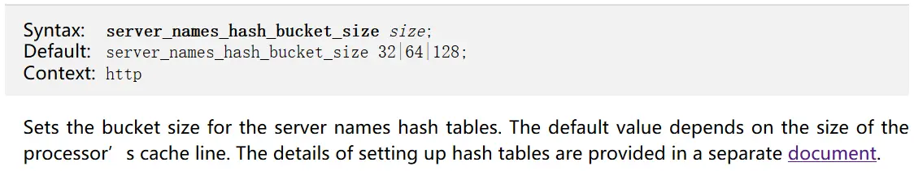
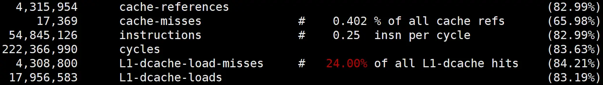
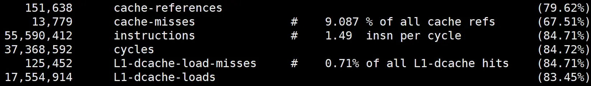
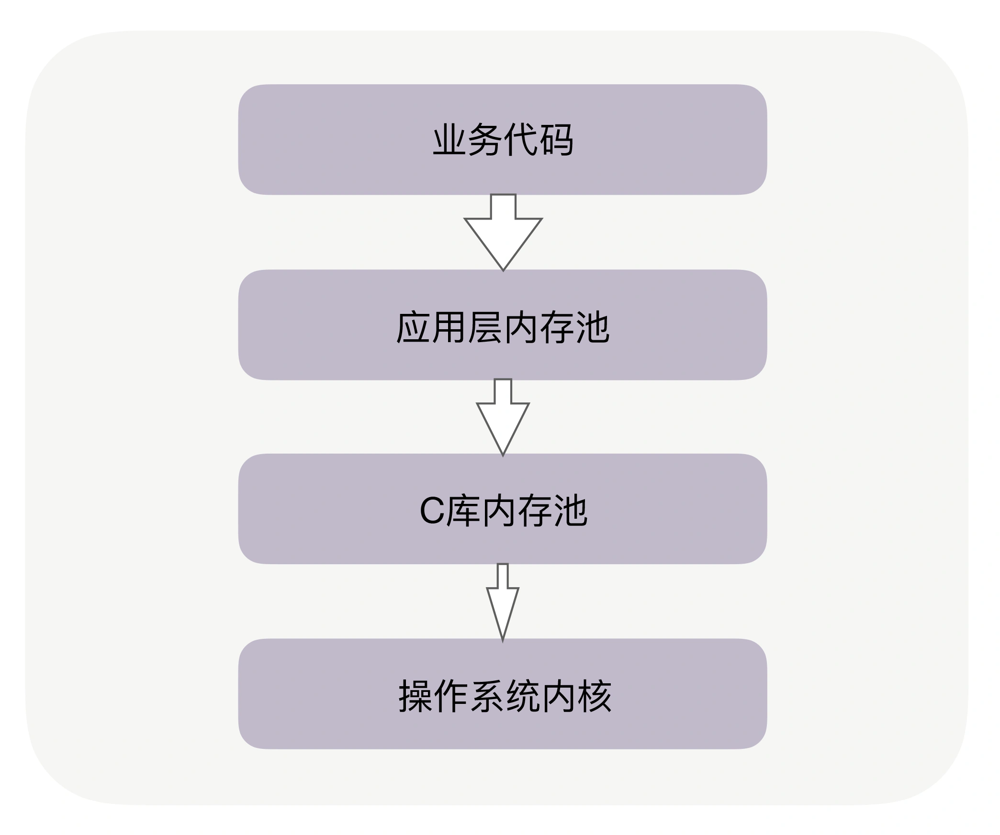

# 系统性能调优必知必会

## 总览

### 根本目的

系统提供的服务要跟上业务的发展脚步

### 问题本质

性能优化的本质就是最大化整个系统的综合效率，为了达到这个目标，我们需要从空间、时间维度上，不断地优化基础资源间的协作方式。

### 系统性能优化核心关注点



### 提升性能时，4 个层次可以入手

* 从提升单机进程的性能入手，包括高效地使用主机的 CPU、内存、磁盘等硬件，通过并发编程提升吞吐量，根据业务特性选择合适的算法。

* 分布式系统是由各个组件通过网络连接在一起，所以优化传输层网络可以让所有组件同时受益。具体优化时，可以从降低请求的时延，提升总体吞吐量两个方向入手。

* 对业务消息采用更高效的编码方式，这既包括协议头、包体的优化，也包括 TLS 安全层的性能提升。具体优化时，既要深入静态编码，也要从动态的增量编码上优化。同时，调整消息的交互方式也能提升性能。
* 最后，从集群整体上进行架构层面的优化。基于 ACP、AKF、NWR 等分布式理论，我们的优化方向仍然是降低时延和提升吞吐量，但实现方式则要运用分而治之的思想，调度集群中的所有结点协作配合，完成性能优化目标。

## 基础设置优化

### CPU缓存：怎样写代码能够让CPU执行得更快

任何代码的执行都依赖 CPU，通常，使用好 CPU 是操作系统内核的工作。然而，当我们编写计算密集型的程序时，CPU 的执行效率就开始变得至关重要。由于 CPU 缓存由更快的 SRAM 构成（内存是由 DRAM 构成的），而且离 CPU 核心更近，如果运算时需要的输入数据是从 CPU 缓存，而不是内存中读取时，运算速度就会快很多。

#### Linux查询缓存大小

```bash
cat /sys/devices/system/cpu/cpu0/cache/index0/size
cat /sys/devices/system/cpu/cpu0/cache/index1/size
cat /sys/devices/system/cpu/cpu0/cache/index2/size
cat /sys/devices/system/cpu/cpu0/cache/index3/size
```



#### CPU三级缓存



当下的 CPU 都是多核心的，每个核心都有自己的一、二级缓存，但三级缓存却是一颗 CPU 上所有核心共享的。程序执行时，会先将内存中的数据载入到共享的三级缓存中，再进入每颗核心独有的二级缓存，最后进入最快的一级缓存，之后才会被 CPU 使用。

缓存要比内存快很多。CPU 访问一次内存通常需要 100 个时钟周期以上，而访问一级缓存只需要 4~5 个时钟周期，二级缓存大约 12 个时钟周期，三级缓存大约 30 个时钟周期（对于 2GHZ 主频的 CPU 来说，一个时钟周期是 0.5 纳秒。如果 CPU 所要操作的数据在缓存中，则直接读取，这称为缓存命中。命中缓存会带来很大的性能提升，因此，**我们的代码优化目标是提升 CPU 缓存的命中率**。

### 提升数据缓存的命中率

#### 数据的访问顺序是如何影响缓存命中率

**code**

```cpp
#include <time.h>
#include <iostream>
#include <unistd.h>
#include <stdlib.h>

using namespace std;

long timediff(clock_t t1, clock_t t2) {
    long elapsed;
	//使用clock统计与取系统时间不同，它表示从进程启动到当下所消耗的CPU计时单元数
    elapsed = ((double)t2 - t1) / CLOCKS_PER_SEC * 1000;
    return elapsed;
}

#define TESTN 2048

int main(int argc, char** argv) {
	int ch;
	bool slowMode = true;

	while((ch = getopt(argc, argv, "fs")) != -1) {
		switch(ch)
		{
		   //-s: 使用arr[j][i]遍历数组
		   case 's':
			  slowMode = true;
			  break;
		   //-f: 使用arr[i][j]遍历数组
		   case 'f':
			  slowMode = false;
			  break;
		}
	}
	cout<<(slowMode?"arr[j][i]":"arr[i][j]")<<endl;

	//在栈上分配二维数组天然是内存连续的，需要注意TESTN的大小，不要超过栈的最大字节
	char arr[TESTN][TESTN];
	//使用clock比取系统时间能够更准确的看到消耗了多少CPU资源
	clock_t start, end;

	if (!slowMode) {
		start =clock();
		for(int i = 0; i < TESTN; i++) {
		    for(int j = 0; j < TESTN; j++) {
				//arr[i][j]是连续访问的
		        arr[i][j] = 0;
		    }
		}
		end =clock();
	    cout<<timediff(start,end)<<endl;
	}else {
		start =clock();
		for(int i = 0; i < TESTN; i++) {
		    for(int j = 0; j < TESTN; j++) {
				//arr[j][i]不是连续访问的
		        arr[j][i] = 0;
		    }
		}
		end =clock();
		cout<<timediff(start,end)<<endl;
	}
}
```

**测试结果**



为什么性能差距会达到4倍？这是因为二维数组 array 所占用的内存是连续，那么内存中从前至后各元素的顺序是

```c
array[0][0]，array[0][1]，array[1][0]，array[1][1]
```

如果用 `array[i][j]`访问数组元素，则完全与上述内存中元素顺序一致，因此访问 `array[0][0]`时，缓存已经把紧随其后的 3 个元素也载入了，CPU 通过快速的缓存来读取后续 3 个元素就可以。如果用 `array[j][i]`来访问，访问的顺序就是：

```c
array[0][0]，array[1][0]，array[0][1]，array[1][1]
```

此时内存是跳跃访问的，如果 N 的数值很大，那么操作 `array[j][i]`时，是没有办法把 `array[j+1][i]`也读入缓存的。

**到这里我们还有 2 个问题没有搞明白：**

为什么两者的执行时间有4 倍的差距呢？

载入 `array[0][0]`元素时，缓存一次性会载入多少元素呢？

其实这两个问题的答案都与 CPU Cache Line 相关，它定义了缓存一次载入数据的大小，Linux 上你可以通过 `coherency_line_size` 配置查看它，通常是 64 字节。



测试的代码一次会载入 64 字节至缓存中。当载入 `array[0][0]`时，若它们占用的内存不足 64 字节，CPU 就会顺序地补足后续元素。顺序访问的 `array[i][j]`因为利用了这一特点，所以就会比 `array[j][i]`要快。也**正因为这样，当元素类型是 4 个字节的整数时，性能就会比 8 个字节的高精度浮点数时速度更快，因为缓存一次载入的元素会更多。因此，遇到这种遍历访问数组的情况时，按照内存布局顺序访问将会带来很大的性能提升。**

为什么执行时间相差 4 倍。在二维数组中，其实第一维元素存放的是地址，第二维存放的才是目标元素。由于 64 位操作系统的地址占用 8 个字节（32 位操作系统是 4 个字节），因此，每批 Cache Line 最多也就能载入不到 8 个二维数组元素，所以性能差距大约接近 8 倍。

CPU Cache Line 的应用其实非常广泛，如果你用过 Nginx，会发现它是用哈希表来存放域名、HTTP 头部等数据的，这样访问速度非常快，而哈希表里桶的大小如 server_names_hash_bucket_size，它默认就等于 CPU Cache Line 的值。由于所存放的字符串长度不能大于桶的大小，所以当需要存放更长的字符串时，就需要修改桶大小，但 Nginx 官网上明确建议它应该是 `CPU Cache Line` 的整数倍。



为什么要做这样的要求呢？**就是因为按照 cpu cache line（比如 64 字节）来访问内存时，不会出现多核 CPU 下的伪共享问题，可以尽量减少访问内存的次数。**比如，若桶大小为 64 字节，那么根据地址获取字符串时只需要访问一次内存，而桶大小为 50 字节，会导致最坏 2 次访问内存，而 70 字节最坏会有 3 次访问内存。

#### 如何查看缓存命中率

linux 使用perf工具可以查看

安装perf

```bash
sudo apt-get install perf
```

执行 perf stat 可以统计出进程运行时的系统信息（通过 -e 选项指定要统计的事件，如果要查看三级缓存总的命中率，可以指定缓存未命中 cache-misses 事件，以及读取缓存次数 cache-references 事件，两者相除就是缓存的未命中率，用 1 相减就是命中率。类似的，通过 L1-dcache-load-misses 和 L1-dcache-loads 可以得到 L1 缓存的命中率），此时你会发现 `array[i][j]`的缓存命中率远高于 `array[j][i]`。当然，perf stat 还可以通过指令执行速度反映出两种访问方式的优劣，如下图所示（instructions 事件指明了进程执行的总指令数，而 cycles 事件指明了运行的时钟周期，二者相除就可以得到每时钟周期所执行的指令数，缩写为 IPC。如果缓存未命中，则 CPU 要等待内存的慢速读取，因此 IPC 就会很低。`array[i][j]`的 IPC 值也比 `array[j][i]`要高得多）：





#### 提升指令缓存的命中率

**code**

```cpp
#include "stdio.h"
#include <algorithm>
#include <fstream>
#include <iostream>
#include <stdlib.h>
#include <time.h>
#include <unistd.h>

using namespace std;

#define TESTN 128 * 1024 * 1024L

long timediff(clock_t t1, clock_t t2)
{
    long elapsed;
    //使用clock统计与取系统时间不同，它表示从进程启动到当下所消耗的CPU计时单元数
    elapsed = ((double)t2 - t1) / CLOCKS_PER_SEC * 1000;
    return elapsed;
}

int main(int argc, char **argv)
{
    int mode = 1;
    int ch;
    while ((ch = getopt(argc, argv, "fsg")) != -1)
    {
        switch (ch)
        {
            //遍历随机数组
        case 's':
            mode = 1;
            break;
        //遍历有序数组
        case 'f':
            mode = 2;
            break;
        //生成数组至文件中，不影响遍历过程时的perf统计
        case 'g':
            mode = 3;
            break;
        }
    }

    unsigned char *arr = new unsigned char[TESTN];

    if (3 == mode)
    {
        //构造随机数组
        for (long i = 0; i < TESTN; i++)
            arr[i] = rand() % 256;
        ofstream ofs;
        //随机数组写入文件
        ofs.open("rand.array", ios::out | ios::binary);
        ofs.write((const char *)arr, TESTN);
        ofs.close();
        //数组排序
        sort(arr, arr + TESTN);
        //有序数组写入文件
        ofs.open("sort.array", ios::out | ios::binary);
        ofs.write((const char *)arr, TESTN);
        ofs.close();
    }
    else
    {
        const char *fname;
        if (1 == mode)
        {
            fname = "rand.array";
        }
        else if (2 == mode)
        {
            fname = "sort.array";
        }
        ifstream ifs;
        ifs.open(fname);
        ifs.read((char *)arr, TESTN);

        //使用clock比取系统时间能够更准确的看到消耗了多少CPU资源
        clock_t start, end;
        start = clock();
        for (long i = 0; i < TESTN; i++)
        {
            //条件分支预测在这里发生作用
            if (arr[i] < 128)
                arr[i] = 0;
        }
        end = clock();
        cout << " " << timediff(start, end) << endl;
    }
}
```

先排序的遍历时间只有后排序的三分之一。为什么会这样呢？这是因为循环中有大量的 if 条件分支，而 CPU含有分支预测器。当数组中的元素完全随机时，分支预测器无法有效工作，而当 array 数组有序时，分支预测器会动态地根据历史命中数据对未来进行预测，命中率就会非常高。**(PS：自己验证其实两种速度都一样)**

究竟有多高呢？我们还是用 Linux 上的 perf 来做个验证。使用 -e 选项指明 branch-loads 事件和 branch-load-misses 事件，它们分别表示分支预测的次数，以及预测失败的次数。通过 L1-icache-load-misses 也能查看到一级缓存中指令的未命中情况


C/C++ 语言中编译器还给应用程序员提供了显式预测分支概率的工具，如果 if 中的条件表达式判断为“真”的概率非常高，我们可以用 likely 宏把它括在里面，反之则可以用 unlikely 宏。当然，CPU 自身的条件预测已经非常准了，仅当我们确信 CPU 条件预测不会准，且我们能够知晓实际概率时，才需要加入这两个宏。

```c
#define likely(x) __builtin_expect(!!(x), 1)
#define unlikely(x) __builtin_expect(!!(x), 0)
if (likely(a == 1)) …
```

#### 提升多核 CPU 下的缓存命中率

前面我们都是面向一个 CPU 核心谈数据及指令缓存的，然而现代 CPU 几乎都是多核的。虽然三级缓存面向所有核心，但一、二级缓存是每颗核心独享的。我们知道，即使只有一个 CPU 核心，现代分时操作系统都支持许多进程同时运行。这是因为操作系统把时间切成了许多片，微观上各进程按时间片交替地占用 CPU，这造成宏观上看起来各程序同时在执行。

**操作系统提供了将进程或者线程绑定到某一颗 CPU 上运行的能力。**如 Linux 上提供了 sched_setaffinity 方法实现这一功能，其他操作系统也有类似功能的 API 可用。我在 GitHub 上提供了一个示例程序（代码见这里），你可以看到，当多线程同时执行密集计算，且 CPU 缓存命中率很高时，如果将每个线程分别绑定在不同的 CPU 核心上，性能便会获得非常可观的提升。**Perf 工具也提供了 cpu-migrations 事件，它可以显示进程从不同的 CPU 核心上迁移的次数。**

```cpp

#include "stdio.h"
#include <iostream>
#include <pthread.h>
#include <sched.h>
#include <stdlib.h>
#include <sys/time.h>
#include <time.h>
#include <unistd.h>

using namespace std;

#define TESTN 16 * 1024L

bool setaffinity = false;

void *loopcalc(void *args)
{
    if (setaffinity)
    {
        cpu_set_t mask; //CPU核的集合
        cpu_set_t get;  //获取在集合中的CPU
        //获取线程的序列号
        int *thread_num = (int *)args;

        //将当前线程绑定至特定CPU
        CPU_ZERO(&mask);
        CPU_SET(*thread_num, &mask);
        if (sched_setaffinity(0, sizeof(mask), &mask) == -1)
        {
            cout << "warning: could not set CPU affinity, continuing...\n";
        }
    }
    timeval tStart, tEnd;
    //这里不再使用clock，因为clock表示的进程所占用过的CPU周期，它将所有CPU都计入了，不适合示例中的统计
    gettimeofday(&tStart, 0);

    //这个循环中由于反复访问有限的数组，CPU缓存命中率非常高
    unsigned char *arr = new unsigned char[TESTN];
    for (long i = 0; i < TESTN; i++)
        arr[i] = rand() % 256;
    for (int j = 1; j < TESTN; j++)
    {
        for (long i = 0; i < TESTN; i++)
            arr[i] += 1;
    }

    gettimeofday(&tEnd, 0);

    //将消耗时间传出到timecost数组中对应的元素上
    *(long *)args = (1000000LL * (tEnd.tv_sec - tStart.tv_sec) + (tEnd.tv_usec - tStart.tv_usec)) / 1000;
}

int main(int argc, char **argv)
{
    int threadnum = 2;
    int ch;
    while ((ch = getopt(argc, argv, "t:fs")) != -1)
    {
        switch (ch)
        {
            //设置测试的并发线程数，注意不要超过机器上的CPU核数
        case 't':
            threadnum = atoi(optarg);
            break;
        //将线程绑定至特定CPU上
        case 'f':
            setaffinity = true;
            break;
        //不绑定CPU
        case 's':
            setaffinity = false;
            break;
        }
    }

    pthread_t *id = new pthread_t[threadnum];
    //统计每个线程计算所需要的时间
    long *timecost = new long[threadnum];
    for (int i = 0; i < threadnum; i++)
    {
        //最初timecost用于传递线程号，用于绑定CPU
        timecost[i] = i;
        int ret = pthread_create(&id[i], NULL, loopcalc, &timecost[i]);

        if (ret != 0)
        {
            cout << "Create pthread error!\n";
            exit(1);
        }
    }

    long costsum = 0;
    //等待所有线程结束
    for (int i = 0; i < threadnum; i++)
    {
        pthread_join(id[i], NULL);
        costsum += timecost[i];
    }
    //比较平均每线程所用时间
    cout << "costsum: " << costsum << ", avg: " << costsum / threadnum << endl;
}
```

#### 思考题

最后请你思考下，多线程并行访问不同的变量，这些变量在内存布局是相邻的（比如类中的多个变量），此时 CPU 缓存就会失效，为什么？又该如何解决呢？欢迎你在留言区与大家一起探讨。

#### 精选留言

因为在多核CPU时代，CPU有“缓存一致性”原则，也就是说每个处理器（核）都会通过嗅探在总线上传播的数据来检查自己的缓存值是不是过期了。如果过期了，则失效。比如声明volitate，当变量被修改，则会立即要求写入系统内存。

一片连续的内存被加载到不同cpu核心中（就是同一个cache line在不同的cpu核心），其中一个cpu核心中修改cache line, 其它核心都失效，加锁也是加在cache line上，其它核心线程也被锁住，降低了性能。解决办法是填充无用字节数，使分开。

```cpp
private:
  // make sure head & tail don't share a cacheline
  union {
    char padding_[GPR_CACHELINE_SIZE];
    Atomic<Node*> head_;
  };
  Node* tail_;

grpc里的代码，实现了一个多生产者单消费者的队列，由于队列的头节点和尾节点会被不同的线程并发访问，为了避免伪共享问题，增加填充字节，确保头节点和尾节点分布于不同的cacheline.
```

温故而知新，nginx的一些锁和记录运行状态的变量每个都是128字节，用的就是填充法吧。

disruptor框架便是其中一个，做了很多cache line的优化。

java的jdk1.7的LinkedTransferQueue就是基于填充法补足64字节


配置 nginx server_names_bucket_siz 的大小

而桶大小为 50 字节，会导致最坏 2 次访问内存，而 70 字节最坏会有 3 次访问内存。

\----------------------------------------------------

为什么 50字节会访问2次内存呢？ 不是可以加载 64k数据到缓存，包含了 50个字节，一次不就够了吗？

70k 也是同样的问题，为什么是3次啊

作者回复: 你好一步，这里的原理其实与思考题是一致的，因为当所有bucket连续时，某个50字节的bucket一定会横跨2个cpu cache line，比如第2个bucket在内存上占用50-100字节，这样当CPU1访问第1个bucket时，会把第2个bucket的数据也载入，这样CPU2访问第2个bucket时，若第1个bucket发生变化，就会导致CPU2必须重新读入bucket。类似的，某个70个字节的bucket一定会占用到3个cpu cache line。文章中写得不够细，我再稍微调整补充下好了。

****

### 内存池：如何提升内存分配的效率？

### 隐藏的内存池

当代码申请内存时，首先会到达应用层内存池，如果应用层内存池有足够的可用内存，就会直接返回给业务代码，否则，它会向更底层的 C 库内存池申请内存。你可能听说过 Google 的 TCMalloc 和 FaceBook 的 JEMalloc，它们也是 C 库内存池。当 C 库内存池无法满足内存申请时，才会向操作系统内核申请分配内存。如



